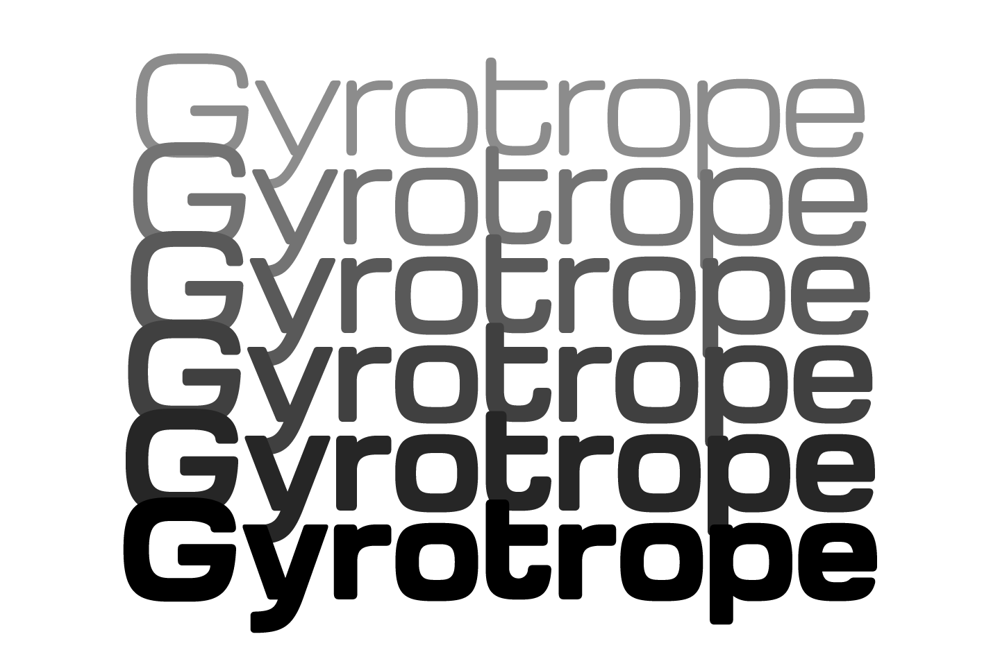

# Gyrotrope

by David Moles

Gyrotrope is a wide, rounded, geometric sans-serif inspired by typefaces
of the 1960s such as Microgramma and Eurostile, as well as contemporary
takes on the genre such as Vernon Adams'
[Michroma](https://github.com/vernnobile/Michroma-font).

Like [Gyrochrome](https://github.com/dmoles/gyrochrome-font) — a
direct derivative of Michroma that was my first attempt at a typeface in
this genre — Gyrotrope exists because I needed a 1960s-futurist typeface
for a project, in a rounded style and a range of weights, on a DIY budget.
As I said of Gyrochrome, if you find it useful, I'm happy, but if you can
afford a real typographer you should definitely hire one.

(That said, issue reports are welcome.)

Gyrotrope is available in six weights, from Regular (400) to Heavy (900).

-- David Moles, 2025-02-03

## Designer

- David Moles

## License

Licensed under the [SIL Open Font License, 1.1](http://scripts.sil.org/OFL);
you may only use these files in compliance with the License.
