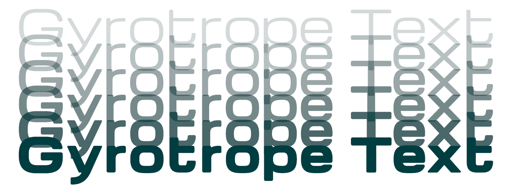

# Gyrotrope

by David Moles

Gyrotrope is a wide, rounded, geometric sans-serif inspired by typefaces
of the 1960s such as Microgramma and Eurostile, as well as contemporary
takes on the genre such as Vernon Adams'
[Michroma](https://github.com/vernnobile/Michroma-font).

Like [Gyrochrome](https://github.com/dmoles/gyrochrome-font) — a
direct derivative of Michroma that was my first attempt at a typeface in
this genre — Gyrotrope exists because I needed a 1960s-futurist typeface
for a project, in a rounded style and a range of weights, on a DIY budget.
As I said of Gyrochrome, if you find it useful, I'm happy, but if you can
afford a real typographer you should definitely hire one.

Gyrotrope is available in two versions, the original _Gyrotrope_ and
_Gyrotrope Text_. Gyrotrope Text has redrawn symbols and punctuation,
better kerning, and more glyphs, as well as slightly different metrics and
proportions, and I recommend it over the original for most applications.
That said, while the original is no longer under active development, issue
reports are welcome for both.

Both are available in six weights, from Regular (400) to Black (900).

-- David Moles, 2025-05-20

## Designer

- David Moles

## License

Licensed under the [SIL Open Font License, 1.1](http://scripts.sil.org/OFL);
you may only use these files in compliance with the License.
